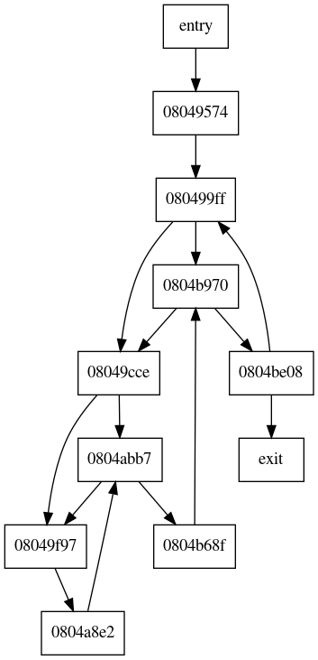

# demov-cfg
Generate Basic CFG for main() in a movfuscated binary

## Required Libraries

  1. [lief](https://github.com/lief-project/LIEF)
  2. [capstone](http://www.capstone-engine.org/)

## Demo

### Input Program

```c
int main()
{
    int i, j, ans = 0;
    for (i = 0; i < 1000; i++) {
        for (j = 0; j < i; j++) {
            for (ans = 0; ans < i*j; ans++) {
                ans += i*j;
            }
        }
    }
    printf("Halt\n");
}
```

### Generated Graph


